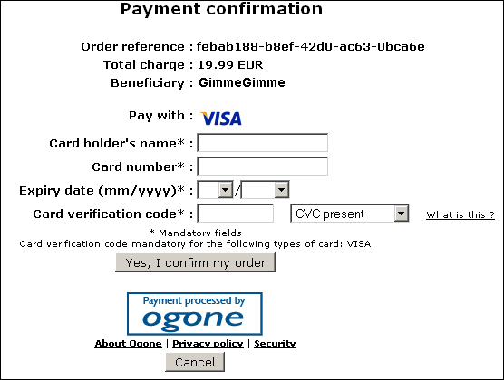

# Ogone Payment Services

## Introduction

You are building an e-commerce web application and you need to support several payment methods (Visa, Mastercard...etc.) so that your customers can easily pay their orders. Rather than implementing this yourself you decide to rely on a trusted third-party provider to provide these services for you.

A well-known company from Belgium that provides payment services is [Ogone](http://www.ogone.be). They provide over 40 international and local payment methods. They handle the payment transactions between your customers, your online shop and the providers of payment methods (e.g. Visa).

Ofcourse you have to pay a small sum for each transaction handled by Ogone, but that buys you integrated fraud protection, security, tools to manage your payments...and much more. The cost of implementing all of this yourself is far greater.

So you signup for an [Ogone account](http://www.ogone.be/) and decide to integrate their system into your web application.

How can we realize this? Let's find out...

## Create a Test Account

First things first, go to the [Ogone website](http://www.ogone.be) and signup for a free test account. At the upper-right corner of the site you"ll find a button labeled "Create your FREE test account".

**Figure 1** - Test Account


Click it and fill out the resulting form. Make sure the data you enter in this form is correct. After submitting your request for a new test account an employee of Ogone will verify your details and depending on the outcome will approve or reject your request. This process might take a few hours. Quite annoying, but there is no way around it.

Once your account has been approved you'll receive an e-mail that contains your password. You are now ready to log on to the [Ogone Merchant Administration](https://secure.ogone.com/ncol/test/frame_ogone.asp?BRANDING=ogone&ISP=&SubID=1&SOLPRO=&MODE=&ACountry=BE&lang=1).

## Configure Your Test Account

Before you can start to use your test account, you need to configure the following settings:

- Your subscription options
- Payment methods
- Technical information

To configure your subscription options click on the option Account displayed in the menu on the left side of the screen.

**Figure 2** - Merchant Administration Menu


On the account page you'll be presented with a few options, select the option "Your subscription". Now you need to choose a subscription type. Choose "Adventure" and click the button labeled "Confirm and go to your options".

Here you can add a number of options to your subscription such as fraud detection, image hosting, invoice look...etc. For this demo we don't need any additional options so just click Confirm to save your settings.

After you've configured your subscription type you can proceed by adding the payment methods you wish to offer to your customers. Click on the option Payment methods in the Merchant Administration Menu (Figure 2). After you've added Visa to the "Selected Payment Methods" list, you need to edit this payment method and set it to activated.

**Figure 3** - Activate Visa Payment Method


Just click on the edit option shown in Figure 3, mark the payment method as activated (Activation: yes) and click on Submit. You can use the the card number 4111 1111 1111 1111 to test Visa payments. Just enter anything for the expiration date and 3 digit security code.

Last but not least you need to configure some technical settings that determine how the online payments will be handled. Proceed by clicking on the option Technical information displayed in the menu (Figure 2).

The resulting page is divided into the following tabs:

- [Global Transaction Parameters](images/ogone4.jpg)
- [Payment Page Layout](images/ogone5.jpg)
- [Data And Origin Verification](images/ogone6.jpg)
- [Transaction Feedback](images/ogone7.jpg)
- [Transaction E-mails](images/ogone81.jpg)

Just click on these links to see screenshots how I've configured my Ogone test account. I've set the SHA-1-IN and SHA-1-OUT signature to "microsoftaspnet4". We'll get back to this later.

## Demo Web Application

You've now created and configured your Ogone test account. You're ready to make your first online payment.

I've created a simple ASP.NET Web Application project that demonstrates how you can integrate Ogone payments within your own ASP.NET enabled website.

**Figure 4** - The Solution


This web application only contains a handful of pages:

- **Default.aspx**: Start page that contains one button that allows you to initiate the payment process
- **PaymentAccepted.aspx**: Called by Ogone when the payment succeeds
- **PaymentCancelled.aspx**: Called by Ogone when the user cancels the payment
- **PaymentException.aspx**: Called by Ogone when the payment fails

**Remark**: As you can see the project also contains a couple of code files. We'll discuss these in the following sections. These files contain the necessary code to handle the payment process with Ogone. Feel free to improve the design, I just included the bare minimum of code to get things working.

## Payment Request

Don't click on the Start Payment button displayed below, it's just a screenshot. This is what the Default.aspx page looks like:

**Figure 5** - The Default.aspx Page


A reference (or order Id) is generated to uniquely identify the order being payed. Ogone keeps track of these references. You cannot process the same reference twice. So that's why I've choosen to use a randomly generated Guid for this example. I had to shorten the Guid to 30 characters because Ogone does not allow more than this limit.

Obviously, besides this reference you also need to specify the amount that has to be paid. The example code also sends along the e-mail address of the customer in question. This way Ogone can e-mail the customer that his payment has been successfully processed.

Let's see the code hidden behind the button's Click event:

**Listing 1** - Request Ogone Payment

```csharp
// Persist order to database
// ...

OgoneRequest ogoneRequest = new OgoneRequest();
ogoneRequest.RequestPayment(this._reference, amount, customerEmail);

// Clear shopping cart
// ...
```

You can start a payment by creating a new instance of the OgoneRequest class and calling the RequestPayment(...) method. This method requires 3 parameters, namely the order reference, the amount that needs to be paid and the e-mail address of the customer.

**Listing 2** - OgoneRequest Constructor

```csharp
public OgoneRequest()
{
    OgoneUrl = ConfigurationManager.AppSettings["Ogone_Url"];
    Psid = ConfigurationManager.AppSettings["Ogone_PSID"];
    ShaKey = ConfigurationManager.AppSettings["Ogone_SHA1_IN"];
    Currency = ConfigurationManager.AppSettings["Ogone_Currency"];
    Language = ConfigurationManager.AppSettings["Ogone_Language"];
    AcceptUrl = ConfigurationManager.AppSettings["Ogone_AcceptUrl"];
    ExceptionUrl = ConfigurationManager.AppSettings["Ogone_ExceptionUrl"];
    CancellationUrl = ConfigurationManager.AppSettings["Ogone_CancellationUrl"];
}
```

The constructor of the OgoneRequest class initializes some properties by reading some values from the application's configuration file (Web.config). You need to specify the URL to call to start the payment process, your Ogone PSID (username), the SHA1-IN key you specified on the Merchant Administration, the redirection URLs...etc.

**Listing 3** - RequestPayment(...) Method

```csharp
public void RequestPayment(string reference, double amount, string email)
{
    // Multiply by one hundred and round to zero decimals
    amount = Math.Round(amount * 100, 0);

    RemotePost post = new RemotePost { Url = this.OgoneUrl };
    post.Add("pspid", this.Psid);
    post.Add("orderid", reference);
    post.Add("amount", amount.ToString());
    post.Add("currency", this.Currency);
    post.Add("language", this.Language);
    post.Add("email", email);

    // Hash
    post.Add("SHASign", Ogone.GenerateHash(
        reference + amount + this.Currency +
        this.Psid + this.ShaKey));

    // Redirection URLs
    post.Add("accepturl", this.AcceptUrl);
    post.Add("exceptionurl", this.ExceptionUrl);
    post.Add("cancelurl", this.CancellationUrl);

    post.Post();
}
```

The RequestPayment(...) method initiates a new payment process by making a HTTP post using the RemotePost class. All the necessary information is included in the post such as your PSID, the amount that needs to be paid, the language, SHA1 sign...etc.

You need to compute the SHA1 hash using the SHA1-IN signature you configured in the Merchant Administration. Ogone states that you also need to include the reference, amount, currency and your PSID in this hash. We'll get back to calculating SHA1 hashes later.

**Remark**: The HTTP post sends along some redirection URLs which Ogone will use when the payment is made, cancelled...etc. If you do not provide these, then the default URLs as configured in the Merchant Administration will be used ([Transaction Feedback](images/ogone7.jpg) tab under Technical information).

**Figure 6** - Payment Confirmation



After starting the payment process you'll be redirected to a new page as seen in the figure above. You can change the lay-out of this page by specifying additional parameters in the HTTP post. Have a look at the source code accompanying this article and the official Ogone documentation for more information on that subject.

## Payment Response

If the user clicks the Cancel button then the payment process will be ended and he'll be redirected to the PaymentCancelled.aspx page. This page just shows a message that the user cancelled the payment process.

But we've configured our Ogone account in such a way that all the relevant information regarding the payment process is included in the query string. For example:

_http://localhost:3767/PaymentCancelled.aspx?orderID=246cf6f0-8bad-4edb-806c-eed3fb&currency=EUR&amount=19.99&PM=CreditCard&ACCEPTANCE=&STATUS=1 &CARDNO=&ED=&CN=&TRXDATE=04%2F08%2F10&PAYID=6806803&NCERROR= &BRAND=...etc._

You can extract information such as the original order reference, the amount, the payment method (e.g.: Visa), payment success status...etc. You can log or discard this information if you desire. It is up to you. Ogone also includes a SHA1 hash composed with the help of the SHA1-OUT signature configured in the Merchant Administration. This hash allows you to verify the identity of the person who made the request and the validity of the data present in the query string.

If the payment process is successfully completed then Ogone will redirect the user to the PaymentAccepted.aspx page. The query string will also include the same data. During the page's load event the status of the payment and the validity of the SHA hash is checked. If both are correct the payment is accepted.

**Listing 4** - PaymentAccepted.aspx Page Load Event Handler

```csharp
OgonePaymentStatus status = OgoneResponse.Status;

// Invalid Sha key returned from Ogone?
bool paymentSucceeded = OgoneResponse.IsShaSignValid && Ogone.IsPaymentStatusValid(status);
```

**Remark**: Ogone includes a parameter called status (integer) in the query string. This status informs you of the status of the payment. The sample code for this article wrapped some of these values in an enum called OgonePaymentStatus. Check out the official Ogone documentation for a list of all possible values. The IsPaymentStatusValid(...) method verifies if the incoming status parameter is one of the values that informs us the payment has been made.

The OgoneResponse class type is just a small wrapper that handles dealing with the query string parameters that Ogone includes when it redirects the user back to your site.

Listing 5 shows you a small excerpt from this class. The IsShaSignValid property reads the SHA1-OUT signature from the application's configuration file (Web.config) and recalculates the SHA sign. To do this you must include other data such as the amount, order reference, currency...etc. (Consult the official Ogone documentation for more information).

If the calculated SHA sign matches the one included in the query string then we are dealing with a request that originates from Ogone and the data in the query string parameters is valid.

**Listing 5** - OgoneResponse Class

```csharp
public static class OgoneResponse
{
    public static string OrderId { get { return HttpContext.Current.Request["orderid"]; } }
    public static string Amount { get { return HttpContext.Current.Request["amount"]; } }
    public static string ShaSign { get { return HttpContext.Current.Request["shasign"]; } }

    public static bool IsShaSignValid
    {
        get
        {
            string key = OrderId + Currency + Amount + PaymentMethod + AcceptanceCode +
                (int)Status + CardNumber + PaymentId + NcError + Brand +
                ConfigurationManager.AppSettings["Ogone_SHA1_OUT"];
            return ShaSign == Ogone.GenerateHash(key);
        }
    }
}
```

## SHA1 Hashes

Listing 6 shows you one possible way how you can calculate a SHA1 hash for a string. The string is converted to a byte array and then encoded using a SHA1CryptoServiceProvider. The resulting hash is then converted into a hexadecimal format.

**Listing 6** - Calculating SHA1 Hashes

```csharp
public static string GenerateHash(string input)
{
    byte[] bytes = new ASCIIEncoding().GetBytes(input);
    SHA1CryptoServiceProvider sha = new SHA1CryptoServiceProvider();
    byte[] hash = sha.ComputeHash(bytes);
    StringBuilder result = new StringBuilder();
    for (int i = 0; i < 20; i++)
    {
        string temp = hash[i].ToString("X2");
        if (temp.Length == 1)
        {
            temp = "0" + temp;
        }
        result.Append(temp);
    }
    return result.ToString();
}
```

And with this, the article ends...

## Summary

I hope you enjoyed this tutorial on how to integrate the Ogone Payment Services with your e-commerce web application. To recap what we’ve covered from a developer’s point of view:

- Creating a Ogone Test Account
- Configuring your Ogone Test Account
- Starting an Ogone Payment Process
- Handling the response of an Ogone Payment Process
- Calculating SHA1 hashes
